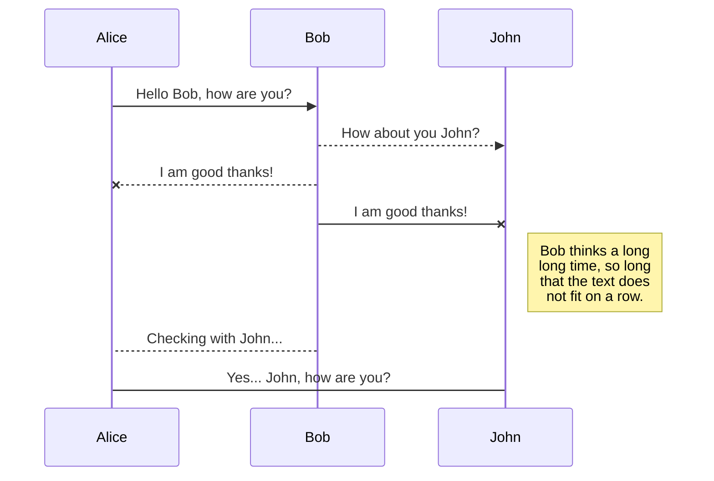
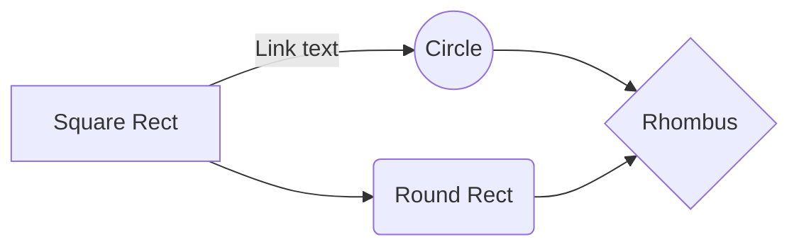

  

# Calculator
A multi-language calculator app. The objective is to create an app using as many language as possible for a scientific calculator.

## Table of contents
1. [Installation](#installation)
    1. [Download](#download)
2. [Key terms](#key-terms)
3. [Examples](#examples)
    1. [Python](#python)
        1. [Windows_CLI](#windows_cli)
4. [Future work](#future-work)
5. [Links](#links)
6. [Feedback](#feedback)
7. [Author](#author)
8. [References](#references)

## Installation

### Download

Run the following command to download the files in your current selected directory.

```bash
git  clone  https://github.com/AnojanCherry/Scientific_calculator.git
```

## Key terms

|Key|Usage|
|--|--|
|()|Bracket|
|**|Indices|
|/|Division|
|*|Multiplication|
|+|Addition|
|-|Subraction|
  
## Examples

### Python

#### Windows_CLI

To run the command line version of the code run the following in the main directory;

- where '(3(.1))**2+2(5)' is the scientific equation followed by -eq or --equation.

```bash
python  .\runMe_cli.py  -eq  "(3(.1))**2+2(5)"
```

## Future work

1. A GUI of the calculator is expected to be done in the future

2. A CPP of the python counter parts (CLI & GUI)

3. A HTML, Css, Js, and PHP

4. A CMD counter part for python cli

5. A Terminal counter part for python cli

## 🔗 Links

[NVARDA](http://nvarda.com/)

[](https://www.linkedin.com/in/ranojan/)

[](https://github.com/AnojanCherry)

## Feedback

If you have any feedback, please reach out to us at anojancherryaji@gmail.com

## Author

- [@AnojanCherry](https://github.com/AnojanCherry)

## References

- danmadeira (2024). _GitHub - danmadeira/simple-icon-badges: All free SVG icons from Simple Icons to Shields.io badges._ [online] GitHub. Available at: https://github.com/danmadeira/simple-icon-badges [Accessed 25 Aug. 2024].
- stackedit.io. (n.d.).  _StackEdit_. [online] Available at: https://stackedit.io/app#.
  
## Ignore the following

You can render LaTeX mathematical expressions using [KaTeX](https://khan.github.io/KaTeX/):

  

The *Gamma function* satisfying $\Gamma(n) = (n-1)!\quad\forall n\in\mathbb N$ is via the Euler integral

  

$$

\Gamma(z) = \int_0^\infty t^{z-1}e^{-t}dt\,.

$$

  

> You can find more information about **LaTeX** mathematical expressions [here](http://meta.math.stackexchange.com/questions/5020/mathjax-basic-tutorial-and-quick-reference).

  
  

## UML diagrams

  

You can render UML diagrams using [Mermaid](https://mermaidjs.github.io/). For example, this will produce a sequence diagram:

  



  

And this will produce a flow chart:

  

